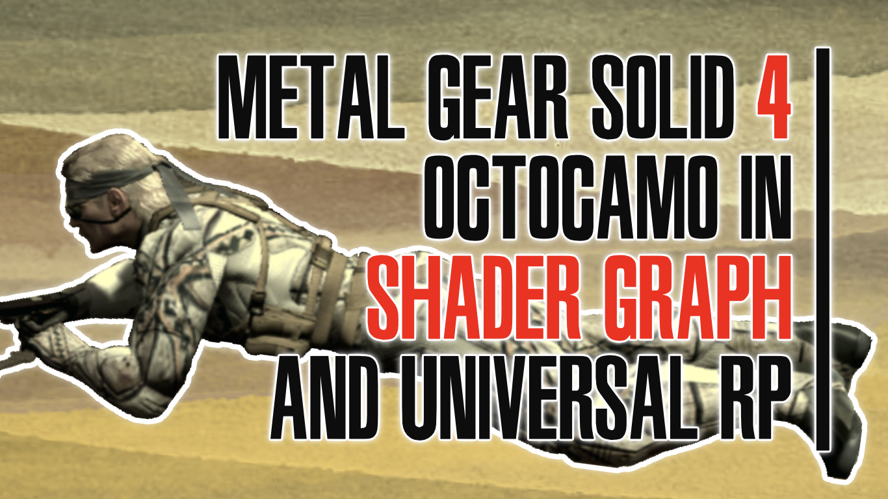

# Metal Gear Solid 4 Octocamo Effect in Shader Graph
A recreation of Metal Gear Solid 4's Octocamo mechanic in Shader Graph &amp; URP.

## Overview

This project contains a (not very good) character controller, which can modify its camouflage, as in *MGS4*. The texture applied to the character is pulled from the ground beneath them, and a shader is used to interpolate between the old texture and the new one. The game also uses the mean color of each texture to determine how similar it is to another texture, which is then used as part of a "camo index" to determine how well-camouflaged the character is. [A tutorial for the project is available on YouTube](https://youtu.be/EwkNOyrk_aQ).

## Software

This project was created using Unity 2019.4.0f1 and Universal Render Pipeline/Shader Graph 7.3.1.

## Authors

This project and the corresponding tutorial was created by Daniel Ilett. 

## Release

This project was released on December 4th 2020.
